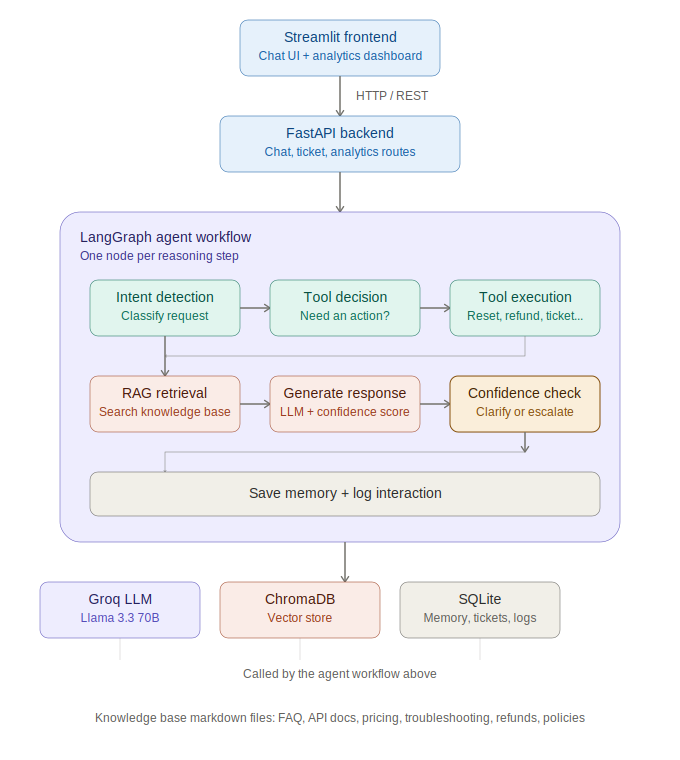

# Enterprise AI Support Agent — TechNova Cloud

A production-style AI customer support platform built to demonstrate
practical AI engineering: Retrieval-Augmented Generation (RAG), agentic
tool calling, LangGraph workflow orchestration, conversational memory, and
a clean FastAPI + Streamlit architecture.

The system simulates the AI support agent for a fictional SaaS company,
TechNova Cloud, rather than acting as a generic chatbot demo.



## What it does

A customer types a question into the chat UI. The system:

1. Classifies intent (Technical Issue, Billing, Refund, Account, API
   Support, Feature Request, or General Inquiry) with a confidence score.
2. Decides whether a tool needs to run -- resetting a password,
   creating a support ticket, checking ticket status, calculating a
   refund, or escalating to a human -- and executes it if so.
3. Retrieves relevant documentation from a knowledge base (FAQ, API
   docs, pricing, troubleshooting, refund policy, company policies) using
   semantic search, when retrieval would actually help.
4. Generates a grounded response and scores its own confidence.
5. Applies the escalation policy: below 30 percent confidence, automatically
   escalates to a human (creates a high-priority ticket); below 60 percent, asks
   a clarifying question instead of guessing.
6. Remembers the conversation so follow-up questions don't need
   repeated context, and logs every interaction for the analytics
   dashboard.

## Tech stack

| Layer | Technology |
|---|---|
| Language | Python |
| Frontend | Streamlit |
| Backend | FastAPI |
| LLM | Llama 3.3 70B Versatile via Groq |
| Agent orchestration | LangChain + LangGraph |
| RAG | ChromaDB + Sentence Transformers |
| Database | SQLite + SQLAlchemy |
| Validation | Pydantic |
| Testing | pytest |
| Containerization | Docker + docker-compose |

## Quick start

```bash
git clone your-repo-url
cd enterprise-ai-support-agent
python -m venv venv && source venv/bin/activate
pip install -r requirements.txt
cp .env.example .env
python -m backend.rag.build_index --rebuild

# terminal 1
uvicorn backend.api.main:app --reload --port 8000

# terminal 2
cd frontend && streamlit run app.py
```

Remember to add your GROQ_API_KEY to .env before starting the backend.

Alternatively, run the whole system with Docker:

```bash
cp .env.example .env   # then add your GROQ_API_KEY
docker compose up --build
```

Then visit http://localhost:8501 for the chat UI.

Full step-by-step instructions, including troubleshooting, are in
docs/INSTALLATION.md.

## Project structure

```
enterprise-ai-support-agent/
backend/
  agents/        reasoning steps: intent, tool decision, response gen
  api/            FastAPI routers and app entrypoint
  database/       SQLAlchemy engine, models, repositories
  graph/           LangGraph nodes and compiled workflow
  memory/          conversation history, DB to LLM-ready format
  models/          shared Pydantic schemas
  rag/             knowledge base chunking, embedding, retrieval
  services/        shared LLM client and top-level agent orchestrator
  tools/            the 6 callable tools and dispatch registry
  utils/            config and logging
frontend/
  app.py            main chat dashboard
  api_client.py      HTTP client for the backend
  pages/
    analytics.py      analytics dashboard
knowledge_base/        FAQ, API docs, pricing, troubleshooting, refunds, policies
tests/                  pytest suite, 38 tests, fully offline and mocked
docs/                    architecture, installation, future improvements
requirements.txt
Dockerfile.backend
Dockerfile.frontend
docker-compose.yml
.dockerignore
.env.example
```

## Architecture

See docs/ARCHITECTURE.md for the full request lifecycle and design
rationale. In short:

```
User message
    v
Streamlit frontend --HTTP--> FastAPI backend --> LangGraph workflow
                                                       |
                          intent detection, tool decision/execution, RAG retrieval
                                            |
                                  generate response and confidence score
                                            |
                              confidence check: clarify, escalate, or pass through
                                            |
                                save memory and log interaction
                                            |
                                    response returned to UI
```

## The 6 agent tools

| Tool | Purpose |
|---|---|
| search_documentation | Semantic search over the knowledge base |
| create_support_ticket | Files a ticket for human-trackable issues |
| check_ticket_status | Looks up ticket(s) by id or session |
| reset_password | Simulates triggering a password reset email |
| calculate_refund | Deterministic refund proration and outage credit math |
| escalate_to_human | Creates a high-priority ticket and flags escalation |

## Testing

```bash
pytest
```

38 tests covering schema validation, refund math (verified against the
exact worked example in the refund policy doc), database repository
behavior, tool registry dispatch, and full LangGraph routing -- including
the exact confidence-threshold boundaries that decide whether a customer
gets a clarifying question or an automatic escalation. All tests run
fully offline with mocked LLM calls.

## Future improvements

See docs/FUTURE_IMPROVEMENTS.md for what a next iteration would add --
native tool-calling, conversation summarization, hybrid search, real
identity and ticketing integrations, PostgreSQL, auth, and CI.

## License

This is a portfolio and demonstration project. TechNova Cloud is a
fictional company created for this project.
